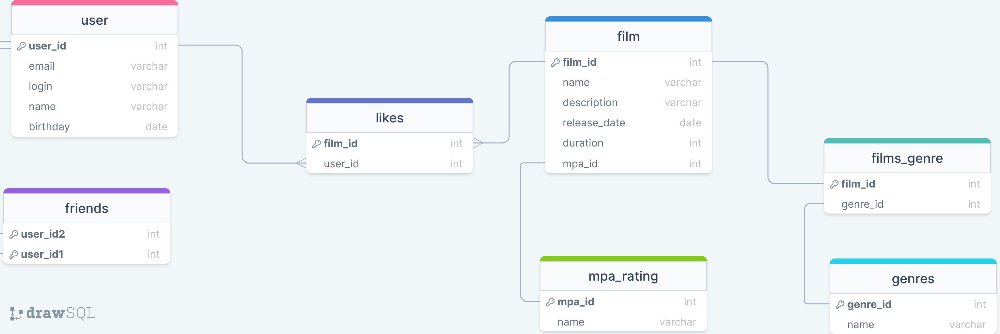

# Сервис для работы с фильмами

**Данная программа позволяет оценивать фильмы и получать топ-фильмов по запросу**

**Используемые стек: Java 11, Spring Boot, Maven, H2**

Реализовал CRUD-операции для моделей: Film, User, Genre; удалить/поставить лайк фильму, получение популярных фильмов, добавление в друзья, получение списка общих друзей.

### Данные будут храниться в Базе Данных. Схема БД представлена ниже. ###




### Примеры Endpoint запросов (программа написана на Java): ###

```java  
@PostMapping
    public User createUser(@Valid @RequestBody User user){
           return userService.createUser(user);
    }
```

```java  
 @GetMapping("/popular")
    public List<Film> popularFilms(@RequestParam(value = "count", defaultValue = "10", required = false) int count ){
        return filmService.popularFilms(count);
    }
```
